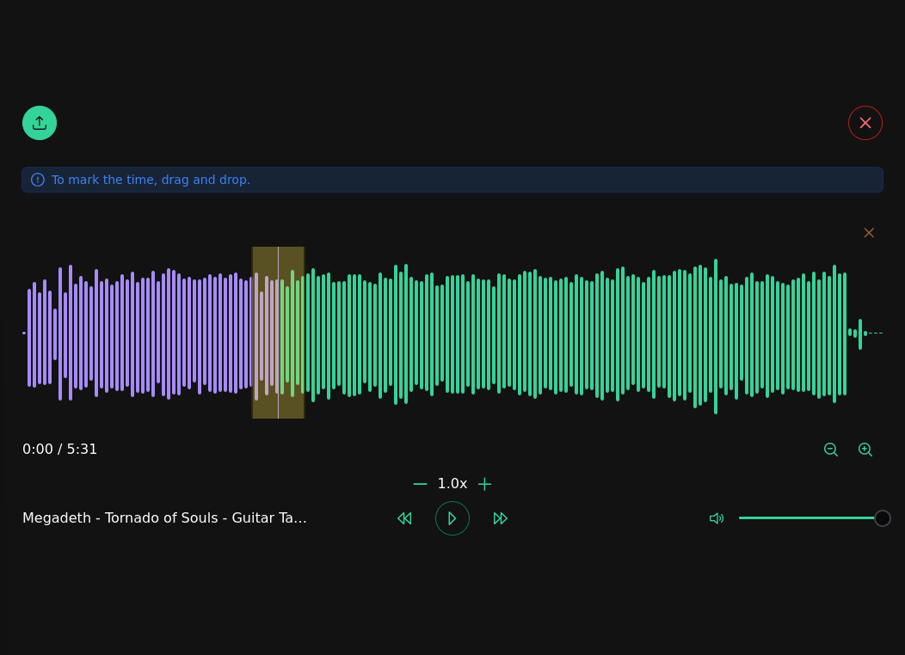

# 🎵 Music Player Desktop App

Um reprodutor de música feito com **Electron**, **Vue 3**, **TypeScript** e **WaveSurfer.js**, com suporte a **marcadores**, **loop**, **controle de velocidade**, **zoom**, e **visualização da forma de onda (waveform)**.



## 🚀 Funcionalidades

- 🎧 Upload de arquivos de áudio
- ▶️ Controles de reprodução: Play / Pause / Forward / Backward
- 🕒 Controle de velocidade da reprodução
- 🎚️ Zoom in/out na waveform (incluindo via scroll do mouse)
- 🔁 Criação de regiões para loop
- 🧼 Remoção do áudio carregado para reset
- 🎨 Cores personalizadas para marcações
- 📦 App desktop via Electron

---

## 📦 Tecnologias Utilizadas

- [Vue 3](https://vuejs.org/)
- [Electron](https://www.electronjs.org/)
- [TypeScript](https://www.typescriptlang.org/)
- [PrimeVue](https://primevue.org/)
- [WaveSurfer.js](https://wavesurfer-js.org/)
- [Vite](https://vitejs.dev/)

---

## 🖥️ Instalação

```bash
# Clone o repositório
git clone https://github.com/seu-usuario/music-player.git
cd music-player

# Instale as dependências
npm install